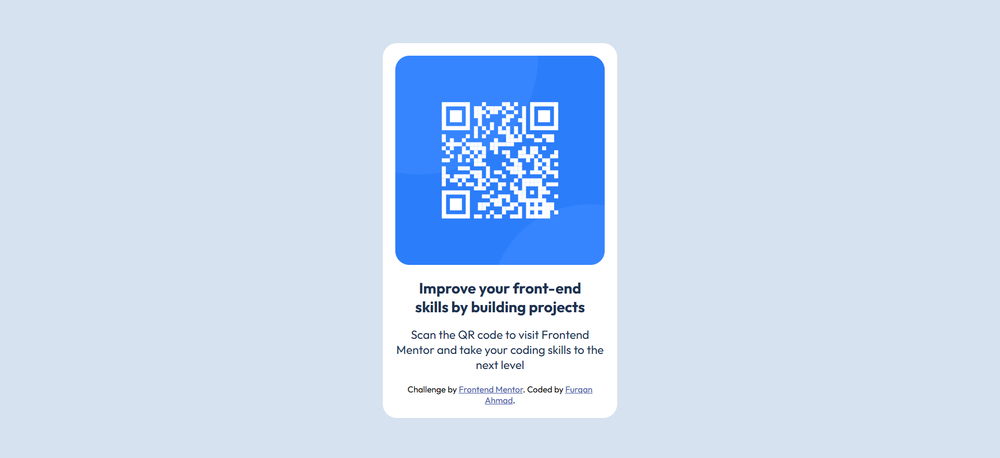

# Frontend Mentor - QR code component solution

This is a solution to the [QR code component challenge on Frontend Mentor](https://www.frontendmentor.io/challenges/qr-code-component-iux_sIO_H). Frontend Mentor challenges help you improve your coding skills by building realistic projects. 

## Table of contents
  - [Screenshot](#screenshot)
  - [Links](#links)
  - [Built with](#built-with)
  - [What I learned](#what-i-learned)

### Screenshot

### Links
Here are some links for this project:
- Solution URL: https://github.com/furqan7m3-ops/qr-code-component.git
- Live Site URL: https://qr-code-component-khaki-tau.vercel.app/

### Built with
This project is implemented with the following:
- HTML5
- CSS3 (custom properties)

### What I learned

I already have some experience with HTML and CSS so it was relatively simple for me to implement this project. However I learnt how to make this project live by deploying it on platform like vercel. I conclusion there is always a room for improvement. Looking forward for more challenges from frontend mentor.
- Frontend Mentor - [furqan7m3-ops](https://www.frontendmentor.io/profile/furqan7m3-ops)